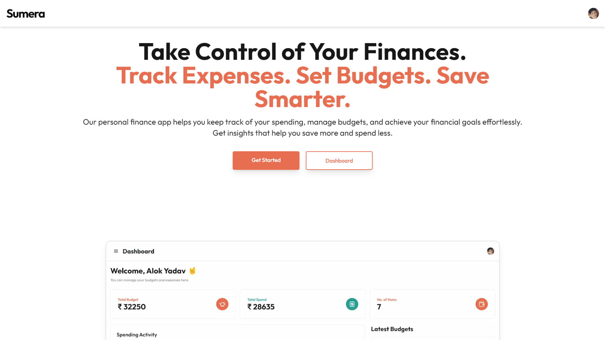
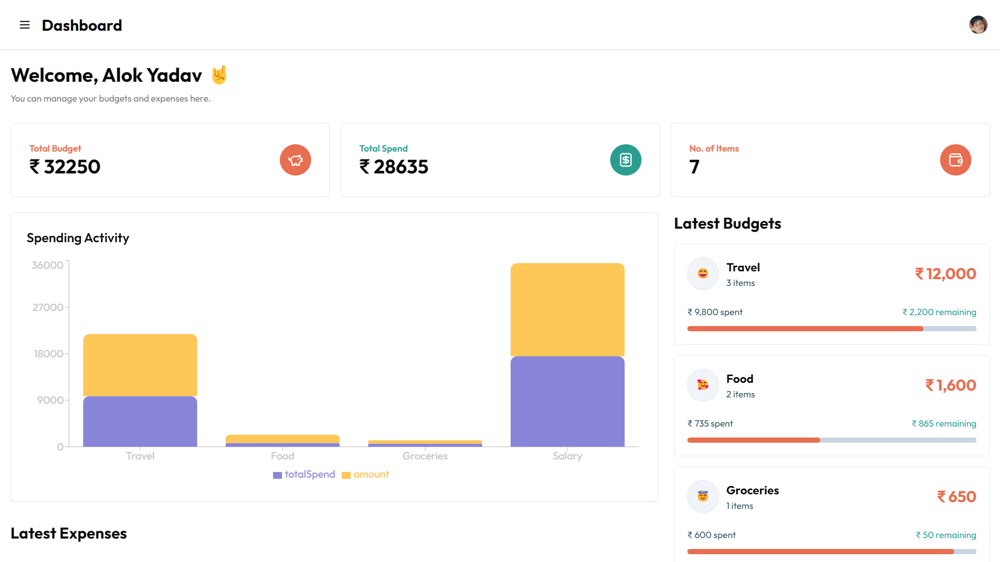

# Sumo | 🦑

Welcome to the **Sumo** app! This project is designed to help you manage your finances effectively by tracking your expenses, setting budgets, and analyzing your spending habits. Built using modern technologies like **Next.js App Router**, **Tailwind CSS**, **Framer Motion**, and **Drizzle ORM**, this app provides an intuitive and smooth user experience.

## Table of Contents

- [Sumo | 🦑](#sumo--)
  - [Table of Contents](#table-of-contents)
  - [Demo](#demo)
  - [Features](#features)
  - [Tech Stack](#tech-stack)
  - [Prerequisites](#prerequisites)
  - [Getting Started](#getting-started)
    - [1. Clone the Repository](#1-clone-the-repository)
    - [2. Install Dependencies](#2-install-dependencies)
    - [3. Setup Environment Variables](#3-setup-environment-variables)
    - [4. Run the Development Server](#4-run-the-development-server)
- [Overview](#overview)
  - [Home Page](#home-page)
  - [Sign-up Page](#sign-up-page)
  - [Dashboard](#dashboard)
  - [Project Structure](#project-structure)
  - [Available Scripts](#available-scripts)
  - [Folder Structure](#folder-structure)
  - [Environment Variables](#environment-variables)
  - [Contributing](#contributing)

## Demo

You can check out the live demo of the project [here](#).

## Features

-   **Expense Tracking**: Track and categorize your daily expenses.
-   **Budget Management**: Set budgets for different categories and monitor them.
-   **Visual Insights**: Get a visual breakdown of your expenses using charts and graphs.
-   **Authentication**: Secure user authentication using `@clerk/nextjs`.
-   **Responsive Design**: Optimized for mobile, tablet, and desktop views.
-   **Animated UI**: Smooth animations and transitions using Framer Motion.
-   **User Dashboard**: Manage and view your expenses and budgets from a single dashboard.

## Tech Stack

-   **Frontend**: Next.js, Tailwind CSS, Framer Motion
-   **Backend**: Next.js API Routes, Drizzle ORM
-   **Database**: PostgreSQL
-   **Authentication**: Clerk.js
-   **Deployment**: Vercel

## Prerequisites

Make sure you have the following installed before starting:

-   [Node.js](https://nodejs.org/) (v16 or above)
-   [Yarn](https://yarnpkg.com/) or npm
-   [PostgreSQL](https://www.postgresql.org/) database

## Getting Started

Follow these steps to get the project up and running locally:

### 1. Clone the Repository

```bash
git clone https://github.com/alok-x0s1/Sumo.git
cd Sumo
```

### 2. Install Dependencies

```bash
# Using Yarn
yarn install

# Or using npm
npm install
```

### 3. Setup Environment Variables

Create a `.env.local` file in the root directory and add the following environment variables:

```env
# Clerk.js Configuration
NEXT_PUBLIC_CLERK_PUBLISHABLE_KEY=<your-clerk-publishable-key>

# Clerk.js Secret Key
CLERK_SECRET_KEY=<your-clerk-secret-key>

# Clerk.js Sign-in and Sign-up URLs
NEXT_PUBLIC_CLERK_SIGN_IN_URL=/sign-in
NEXT_PUBLIC_CLERK_SIGN_UP_URL=/sign-up

# Database URL
NEXT_PUBLIC_DATABASE_URL=<your-postgres-database-url>
```

### 4. Run the Development Server

Start the app in development mode:

```bash
# Using Yarn
yarn dev

# Or using npm
npm run dev
```

The app should now be running on [http://localhost:3000](http://localhost:3000).

# Overview

This is a personal finance app that helps you track your expenses, set budgets, and analyze your spending habits.

## Home Page

The home page is the first page that the user sees when they visit the app. It is the landing page. It has a hero section with a sign-in button.



## Sign-up Page

The sign-up page is the page that the user sees when they click the sign-in button on the home page. It is the page that allows the user to sign up for the app.


## Dashboard

The dashboard is the page that the user sees when they sign in to the app. It is the page that allows the user to manage their expenses and budgets.



## Project Structure

Something like this:

```bash
.
├── README.md
├── .env.local
├── public
│   └── finance-dashboard.png       # Static image files
├── src
│   ├── app
│   │   ├── layout.tsx              # Application layout file
│   │   ├── page.tsx                # Main page
│   │   ├── dashboard               # Dashboard-related pages
│   │   │   └── page.tsx            # Dashboard page
│   │   └── sign-in                 # Sign-in related pages
│   ├── components
│   │   ├── Hero.tsx                # Hero section component
│   │   ├── Navbar.tsx              # Navigation bar
│   │   └── Footer.tsx              # Footer component
│   ├── hooks                       # Custom hooks
│   ├── lib
│   │   └── drizzle.ts              # Drizzle ORM configuration
│   ├── pages                       # Next.js traditional pages
│   ├── styles                      # Global styles and configurations
│   │   └── globals.css
├── tailwind.config.js              # Tailwind CSS configuration
├── tsconfig.json                   # TypeScript configuration
└── next.config.js                  # Next.js configuration
```

## Available Scripts

Here are some commonly used scripts to help manage the project:

-   **`npm run dev`**: Start the development server.
-   **`npm run build`**: Create an optimized production build.
-   **`npm run start`**: Start the production server.

## Folder Structure

The folder structure follows Next.js conventions, separating components, hooks, styles, and API routes for a clean and maintainable architecture.

## Environment Variables

Make sure to set up the environment variables in a `.env.local` file as mentioned in the [Getting Started](#getting-started) section.

## Contributing

Contributions are welcome! Please follow these guidelines:

1. Fork the repository.
2. Create a new branch (`feat/your-feature`).
3. Open a Pull Request with a detailed description of your changes.
